<!-- markdownlint-disable MD001 -->
<!-- markdownlint-disable MD010 -->
<!-- markdownlint-disable MD007 -->
<!-- markdownlint-disable MD027 -->
<!-- markdownlint-disable MD036 -->

# Dynamic Traffic Load Balancing based on OpenFlow

## Project Report

#### Project 6

Emmanuele Benedetto (10520167)

Ilaria Campagna (10491234)

Fabio Carminati (10526562)

Dhiraj Bhasin (10512720)

Academic year 2018/2019

#### Table of contents

1. [Introduction](#introduction)
    - [Objective](#objective)
    - [Theoretical background](#background)
2. [EdgeStats class](#edge)
    - [Class attributes](#edge_att)
    - [Methods](#edge_methods)
3. [LoadBalancingSwitch class](#load)
    - [Constants](#const)
    - [Attributes](#cont_att)
    - [Parameters](#parameters)
    - [Methods](#cont_methods)
    - [Use case](#uc1)
4. [Plots' module](#plots)
5. [TestBed](#testbed)
    - [Problem 1](#p1)
        - [Solution](#s1)
    - [Problem 2](#p2)
        - [Solution](#s2)
            - [Problem 2.1](#p2.1)
                - [Solution A](#sA)
                - [Solution B](#sB)
                - [To verify](#ver)
    - [Problem 3](#p3)
        - [Solution](#s3)
    - [Problem 4](#p4)
        - [Solution](#s4)
    - [Problem 4](#p5)
        - [Solution](#s5)
6. [Tutorial](#tutorial)
    - [Tutorial 0](#tutorial0)
    - [Tutorial 1](#tutorial1)
    - [Tutorial 2](#tutorial2)
7. [References and Tools](#ref)

<div style="page-break-after: always;"></div>

## Introduction <a name="introduction"></a>

### Objective <a name="objective"></a>

The goal of the project is to implement an algorithm to load balance the traffic based on link parameters or load on a switch. This algorithm works on a multipath network where there are multiple paths from one switch to another.
To improve the overall performance of the network, links statistics are constantly monitored  such that, if a link exceeds a certain threshold(**LINK_THRESHOLD**), the controller looks for the flow which is using more bandwidth between those with the lower DSCP.

### Theoretical background <a name="background"></a>

When a new flow has to be routed, we look for the shortest path between the sender and the receiver in order to distribute flows among the network and avoid overloaded links.

The problem is that we can't know in advance how much bandwidth the connection will require and so it can happen that some links overload.

TCP uses a congestion window in the sender side to do congestion avoidance. The congestion window indicates the maximum amount of data that can be sent out on a connection without being acknowledged. This way, the TCP protocol can adapt the bandwidth to the network it is working on, even if it doesn't know the topology.

With a *Software Defined Networking* approach, the controller knows the network topology. Thus, it is possible to define a threshold below which all connections can be handled by the switches, without any problem of congestion. If that threshold is exceeded, the controller decides to reallocate one flow among the ones active on that link. First, it looks for the flow with the lowest DSCP: this way it can guarantee the best service to the flows with higher DSCP. Then it looks for the flow with the highest bandwidth.

By load balancing, the controller reallocates one of the flows on the link that exceeded a given threshold. In doing so, the controller proactively prevents TCP from seeing the network congested, and consequently prevents it from activating its congestion control mechanism and from slowing down the rate of the connection. Thus, improving the quality of the connection, in terms of throughput and packet loss.
With this approach, a UDP connection can also be granted a high-quality service (_provided that it has a high ToS value in the DSCP field_).  If there's a reallocation due to a network congestion, the UDP connection won't be chosen by the controller, and the connection will never see the network as overloaded.

[//]: # "Reactive for the rules, proactive towards TCP"

<div style="page-break-after: always;"></div>

<!-- markdownlint-disable MD010 -->
<!-- markdownlint-disable MD007 -->
<!-- markdownlint-disable MD027 -->
<!-- markdownlint-disable MD036 -->

# EdgeStats class <a name="edge"></a>

We created this class in order to have a container for statistics and useful information about each link.

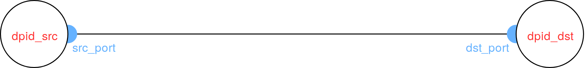

~~~python
import numpy as np
~~~

We need the `numpy` module in order to calculate the mean throughput, for each flow and for the source port.

## Class attributes <a name="edge_att"></a>

### link = (src_dpid, dst_dpid)

- Link identifier
	- *src_dpid*: datapath ID of the source switch
	- *dst_dpid*: datapath ID of the destination switch
	- type: *tuple*

### src_port

- Source port
	- type: *int*

### dst_port

- Destination port
	- type: *int*

### match_to_stats

- Keeps tracks of each active flow on the link to its statistics
	- type: *dict*
- The key is the match, which defines a flow. The values are statistical information about how the link is used by a specific flow.
- The structure of the dictionary is the following (in the case of N active flows on that link):

~~~python
{
	match_1: {
				'throughput':  float
				'mean_throughput':  float
				'prev_tx_bytes':  int
				'curr_tx_bytes':  int
				'prev_alive_time':  float
				'curr_alive_time':  float
				'time_interval':  float
				'throughputs_array':  list
	}
	...
	match_N: { ... }
}
~~~

### src_port_stats

- Keeps track of the source port statistics
	- type: *dict*

All the attributes are initialized in the init function:

~~~python
class EdgeStats:

	def __init__(self, src_dpid, dst_dpid):
		self.link = (src_dpid, dst_dpid)
		self.src_port = 0
		self.dst_port = 0
		self.match_to_stats =  {}
		self.src_port_stats = {}
		self.initialize_port_dict()
~~~

<div style="page-break-after: always;"></div>

## Methods <a name="edge_methods"></a>

### initialize_port_dict

It's called in the initialization phase, to inizialize _src_port_stats_ dictionary:

~~~python
	def initialize_port_dict(self):
		self.src_port_stats['throughput'] =  0
		self.src_port_stats['mean_throughput'] =  0
		self.src_port_stats['prev_tx_bytes'] =  0
		self.src_port_stats['curr_tx_bytes'] =  0
		self.src_port_stats['prev_alive_time'] = 0
		self.src_port_stats['curr_alive_time'] = 0
		self.src_port_stats['time_interval'] = 0
		self.src_port_stats['throughputs_array'] = []
~~~

### add_match_to_edge

This function is called when a new flow is instantiated. It takes in input a match, of type `ryu.ofproto.ofproto_v1_3_parser.OFPMatch`, which is then passed to the method _extract_field_. This last method parses the match and returns it as a tuple of tuples. The entry is then added to the dictionary _match_to_stats_ and its values are initialized.

~~~python
	def add_match_to_edge(self, match):
		match = self.extract_fields(match)
		#self.logger.info("Added rule {} on the link {}".format(match, self.link))
		self.match_to_stats[match] = {}
		self.match_to_stats[match]['throughput'] =  0
		self.match_to_stats[match]['mean_throughput'] =  0
		self.match_to_stats[match]['prev_tx_bytes'] =  0
		self.match_to_stats[match]['curr_tx_bytes'] =  0
		self.match_to_stats[match]['prev_alive_time'] =  0
		self.match_to_stats[match]['curr_alive_time'] =  0
		self.match_to_stats[match]['time_interval'] =  0
		self.match_to_stats[match]['throughputs_array'] =  []
~~~

### remove_match_from_edge

Deletes the entry associated to the passed match from the dictionary _match_to_stats_. This function is used either when a rule is deleted or when it is overwritten. In the latter case, the function _add_match_to_edge_ must be called right after calling _remove_match_from_edge_, in order to reset and update the link's statistics.

[//]: # "If we don't do that, the time will be negative: this is because it resets and we are stuck with the values of prev_time of the previous rule. This only happens with the switches that are in common between the previous and the current path."

~~~python
	def remove_match_from_edge(self, match):
		#self.logger.info("Removed rule {} from the link {}".format(match, self.link))
		del self.match_to_stats[match]
		#self.logger.info("Here's the dictionary now {}".format(self.match_to_stats))
~~~

### retrieve_value

It's given as inputs a *match* and a string, *value_string*, used as keys to access a value in the _match_to_stats_ dictionary.

~~~python
	def retrieve_value(self, match, value_string):
		return self.match_to_stats[match][value_string]

~~~

### update_weight_from_FlowStatsReply

It's called in the `FlowStatsReply` function of the LoadBalancingSwitch class and it's used to update the values in the match_to_stats dictionary.

**Parameters**

- *byte_count*
	- number of bytes matched on that flow from the beginning
	- type: *int*
- *duration_sec*
	- time the flow has been alive in seconds
	- type: *int*
- *duration_nsec*
	- time the flow has been alive in nanoseconds, beyond *duration_sec*
	- type: *float*
- *match*
	- match field in the message
	- type: class `ryu.ofproto.ofproto_v1_3_parser.OFPMatch`

**Methods**

- *extract_fields(match)*
	- parses the match and returns it as tuple of tuples

~~~python
	def update_weight_from_FlowStatsReply(self, byte_count, duration_sec, duration_nsec, match):
		match = self.extract_fields(match)
		self.match_to_stats[match]['curr_tx_bytes'] = byte_count
		self.match_to_stats[match]['curr_alive_time'] = duration_sec + duration_nsec * 10**(-18)
		self.match_to_stats[match]['time_interval'] = (self.match_to_stats[match]['curr_alive_time'] - self.match_to_stats[match]['prev_alive_time'])
		if self.match_to_stats[match]['time_interval'] < 0:
			self.logger.debug("Time < 0 for the rule of the link {} - {}, src_port {}, match {}, something's not right :<".format(self.link[0], self.link[1], self.src_port, match))
			self.logger.debug("Values: curr_tx_bytes {},  curr_alive_time {}, time_interval {}".format(self.match_to_stats[match]['curr_tx_bytes'],self.match_to_stats[match]['curr_alive_time'], self.match_to_stats[match]['time_interval']))
		self.match_to_stats[match]['prev_alive_time'] = self.match_to_stats[match]['curr_alive_time']
		self.match_to_stats[match]['throughput'] = (self.match_to_stats[match]['curr_tx_bytes'] - self.match_to_stats[match]['prev_tx_bytes'])/self.match_to_stats[match]['time_interval']
		self.match_to_stats[match]['prev_tx_bytes'] = byte_count
		self.match_to_stats[match]['throughputs_array'].append(self.match_to_stats[match]['throughput'])
		self.match_to_stats[match]['mean_throughput'] = np.mean(self.match_to_stats[match]['throughputs_array'])
~~~

### update_weight_from_PortStatsReply

It's called in the `PortStatsReply` function of the LoadBalancingSwitch class and it's used to update the source port statistics.

**Parameters**

- *tx_bytes*
	- number of transmitted bytes from the beginning
	- type: *int*
- *duration_sec*
	- time the flow has been alive in seconds
	- type: *int*
- *duration_nsec*
	- time the flow has been alive in nanoseconds, beyond *duration_sec*
	- type: *float*

~~~python
	def update_weight_from_PortStatsReply(self, tx_bytes, duration_sec, duration_nsec):
		self.src_port_stats['curr_tx_bytes'] = tx_bytes
		self.src_port_stats['curr_alive_time'] = duration_sec + duration_nsec * 10**(-18)
		self.src_port_stats['time_interval'] = self.src_port_stats['curr_alive_time'] - self.src_port_stats['prev_alive_time']
		if self.src_port_stats['time_interval'] < 0:
			self.logger.debug("Time < 0 for the rule of the link {} - {}, src_port {}, match {}, something's not right :<".format(self.link[0], self.link[1]))
			self.logger.debug("Values: curr_tx_bytes {},  curr_alive_time {}, time_interval {}".format(self.src_port_stats['curr_tx_bytes'],self.src_port_stats['curr_alive_time'], self.src_port_stats['time_interval']))
		self.src_port_stats['prev_alive_time'] = self.src_port_stats['curr_alive_time']
		self.src_port_stats['throughput'] = (self.src_port_stats['curr_tx_bytes'] - self.src_port_stats['prev_tx_bytes']) / self.src_port_stats['time_interval']
		self.src_port_stats['prev_tx_bytes'] = tx_bytes
		self.src_port_stats['throughputs_array'].append(self.src_port_stats['throughput'])
		self.src_port_stats['mean_throughput'] = np.mean(self.src_port_stats['throughputs_array'])
~~~

### extract_fields

Extracts the fields that identify a flow from the passed *match*, and returns them as a tuple.

**Parameters**

- *match*
	- match field in the message
	- type: : class `ryu.ofproto.ofproto_v1_3_parser.OFPMatch`

**Returns**

A tuple of tuples of the extracted fields

Example:

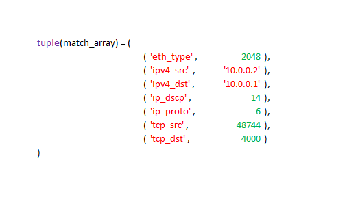

~~~python
	def extract_fields(self, match):
		match_array = [0,0,0,0,0,0,0]
		for field in match._fields2:
			if field[0] == 'eth_type':
				match_array[0] = (field[0], field[1]) # field[1] type int
			elif field[0] == 'ipv4_src':
				match_array[1] = (field[0], field[1]) # field[1] type str
			elif field[0] == 'ipv4_dst':
				match_array[2] = (field[0], field[1]) # field[1] type str
			elif field[0] == 'ip_dscp':
				match_array[3] = (field[0], field[1]) # field[1] type int
			elif field[0] == 'ip_proto':
				match_array[4] = (field[0], field[1]) # field[1] type int
			elif field[0] == 'udp_src' or field[0] == 'tcp_src':
				match_array[5] = (field[0], field[1]) # field[1] type int
			elif field[0] == 'udp_dst' or field[0] == 'tcp_dst':
				match_array[6] = (field[0], field[1]) # field[1] type int
		return tuple(match_array)
~~~

<div style="page-break-after: always;"></div>

<!-- markdownlint-disable MD001 -->
<!-- markdownlint-disable MD041 -->
<!-- markdownlint-disable MD024 -->

<!-- markdownlint-disable MD001 -->
<!-- markdownlint-disable MD041 -->
<!-- markdownlint-disable MD024 -->

# LoadBalancingSwitch class <a name="load"></a>

~~~python
from ryu.base import app_manager
from ryu.controller import ofp_event, dpset, ofp_event
from ryu.controller.handler import CONFIG_DISPATCHER, MAIN_DISPATCHER, set_ev_cls
from ryu.app.wsgi import ControllerBase, WSGIApplication
from ryu.ofproto import ofproto_v1_3, ether
from ryu.lib.packet import packet, ethernet, ether_types, arp, ipv4, tcp, udp
from ryu.lib.packet.packet import Packet
from ryu.topology.api import get_switch, get_link, get_host
from ryu.topology import event, switches
import networkx as nx
from ryu.app.ofctl.api import get_datapath
from ryu.lib import hub
from collections import defaultdict
import time
import json
import matplotlib.pyplot as plt
import logging
import threading
import realtimeplt as rtp
from edgestats import EdgeStats
~~~

The following line is needed to plot in interactive mode and has to be the first instruction (after the import statements).

~~~python
plt.ion()
~~~

## Constants <a name="const"></a>

##### DEFAULT_WEIGHT

~~~python
DEFAULT_WEIGHT = 1
~~~

This is the defalut weight assigned to arcs. We have set it to 1 so that, if there are no active connections and links have 0 throughput, the shortest path is computed considering a path with less hops.

##### NUMBER_OF_SWITCH_PORTS

~~~python
NUMBER_OF_SWITCH_PORTS = 6    # To be set according to the topology
~~~

##### SLEEP

~~~python
SLEEP = 8
~~~

The OVSwitches update their statistics table every .5 seconds: in order to have real-time data, we should monitor every _SLEEP = .5_ seconds. We used a much higher time because of how iperf3 behaves.

If we want to set up a connection with a particular ToS, iperf3 starts three connections after the "definitive" one and this takes some time. If we update the statistics immediately after the first try, the "definitive" flow will be allocated in a path different from the first one, because the shortest_path function will see that the first path is already in use.

Since we want the flow to be routed according to the path chosen for the first connection, we need to start the connection immediately after the statistics update, and not update statistics until the end of the three connections.

##### WAIT_FOR_STATISTICS

~~~python
WAIT_FOR_STATISTICS = 1
~~~

The time we wait before plotting, because we are waiting for the switches to reply to the request for statistics, and for the controller to process this message.
This value depends on:

1. the time between the request for statistics and the switch's reply.
2. the time from the switch's reply to when the controller examines it. This also depends on the number of matches contained in each reply.

Thus, this value has to be set based on the number of switches in the network.

In our test, we had 8 matches per switch and we observed (worst case):

1. .05s from request to response
2. .008s to process each reply

So, since we have 12 switches in our topology, we should wait for at least .05s + 12*.008s = .146s. We chose 1s.

An easier solution is to plot every time new statistics arrive, so in the FlowStatsReply. We didn't implement it because the statistics arrive simultaneously, so the plot window is updated too often in a short period of time, and `matplotlib` lags.

##### SLEEP_TH

How often the threshold on each link is monitored.

Since _SLEEP_TH_ is synchronized with a chosen multiple of _SLEEP_, before checking if there's a link that exceeded the threshold, we wait for _WAIT_FOR_STATISTICS_ seconds.
To keep it synchronized with the statistics update, only the numerical number can be changed.

~~~python
SLEEP_TH = WAIT_FOR_STATISTICS + SLEEP * 2
~~~

##### MAGNITUDE_MEGA_BYTES

~~~python
MAGNITUDE_MEGA_BYTES = 10**6
~~~

##### LINK_THRESHOLD

~~~python
LINK_THRESHOLD = 103 * MAGNITUDE_MEGA_BYTES
~~~

##### MAG_STR

~~~python
MAG_STR = "MByte"
~~~

##### MAX_RTT_ADMITTED

~~~python
MAX_RTT_ADMITTED = 2
~~~

_MAX_RTT_ADMITTED_ is passed as the _idle_timeout_ flag when adding a flow entry to the table. This way we are sure that, when we check the rules in the table of the switch that has just had a flow reallocated, we don't reallocate the flow based on the previous rule.

The value of _MAX_RTT_ADMITTED_ has to be much lower than _SLEEP_TH_, in order to be sure that, if we check the rule on the same switch interested in the reallocation process, we don't base the reallocation on the previous rule.

We could've just deleted the rule right after changing the routing path, but if there were packets still in queue, there would've been a lot PacketIns.

If _MAX_RTT_ADMITTED_ is too small, `iperf3` doesn't consider the ToS anymore. This is probably because `iperf3` opens 3 connections with ToS=0 before the actual one, so it needs time and the rules must not expire too soon.
In order to be notified when a flow expires, the flag _OFPFF_SEND_FLOW_REM_ has to be included.

##### PKT_IN_STOP_TIMER

~~~python
PKT_IN_STOP_TIMER = 20
~~~

See the section of the function that uses it (see [restart_pkt_in](#restart_pkt_in)).

##### MIN_FLOW_BW

~~~python
MIN_FLOW_BW = 0.3*MAGNITUDE_MEGA_BYTE
~~~

We don't plot connections with bandwidth lower than _MIN_FLOW_BW_.

## Parameters <a name="parameters"></a>

~~~python
  def __init__(self, *args, **kwargs):  
    super(LoadBalancingSwitch, self).__init__(*args, **kwargs)
    wsgi = kwargs['wsgi']
    self.topology_api_app = self
    self.net = nx.DiGraph()
    self.pos = 0
    self.topo_init = False
    self.reallocated = False
    self.datapaths = {}
    self.mac_to_port = {}
    self.mac_to_dpid = {}
    self.port_to_mac = {}
    self.ip_to_mac = {}
    self.edge_stats = {}
    self.match_path_and_prio = {}
    self.switch_to_hosts_mac = {}
    self.hosts_dict = {}
    self.port_occupied = defaultdict(lambda: defaultdict(int))
    self.pkt_in_just_served = defaultdict(lambda: False)
    self.net_percentages = defaultdict(lambda: [])
    # Table information
    self.table_rows_labels = []
    self.table_columns_labels = []
    self.table_data = []
    # Declaration of the threads for the requests to switches
    self.monitor_thread = hub.spawn(self._monitor)
    self.threshold_thread = hub.spawn(self._monitor_threshold)
~~~

#### net

- A *DiGraph* object that stores nodes and edges of our custom topology
- Initial assignment _net = nx.DiGraph()_ : creates an empty graph structure with no nodes and no edges

#### pos

- Defines the positions of nodes in the topology plot
- Initial assignment _pos = 0_: no predefined initial positions for nodes

#### topo_init

- *Boolean* variable to check whether the topology has been already created or not
- Initial assignment _topo_init = False_: at the beginning we assume that the topology doesn't exist yet

#### reallocated

- *Boolean* variable used to make sure that just one flow on one link is reallocated for each loop of the thread `_monitor_thread`
- Initial assignment _reallocated = False_: no reallocation process has been performed yet

#### datapaths

- *Dictionary* that maps a switch's datapath ID (key) to its full datapath (value)
- Initial assignment _datapaths = {}_ : empty dictionary

#### mac_to_port

- *Dictionary* that maps a switch's datapath ID (key 1) and the MAC address (key 2) with to the corresponding interface (value)
- Initial assignment _mac_to_port = {}_ : empty dictionary

#### mac_to_dpid

- *Dictionary* that maps a host's MAC address (key) to the datapath ID (value) of the switch it's connected to
- Initial assignment _mac_to_dpid = {}_ : empty dictionary

#### port_to_mac

- *Dictionary* that maps a host's MAC address (value) through a switch's datapath ID (key1) and his proper interface (key 2)
- Initial assignment _port_to_mac = {}_ : empty dictionary

#### ip_to_mac

- *Dictionary* that maps a host's IP address (key) with his MAC address (value)
- Initial assignment _ip_to_mac = {}_ : empty dictionary

#### edge_stats

- *Dictionary* that maps each link (key, type: tuple) with his correspondent **EdgeStats** class
- Initial assignment _edge_stats = {}_ : empty dictionary

#### match_path_and_prio

- *Dictionary* that maps a flow's match (key) to the path it's routed on and its priority (value, type: tuple)
- Initial assignment _match_path_and_prio = {}_ : empty dictionary

#### switch_to_hosts_mac

- *Dictionary* that maps each switch's datapath ID (key) to the list (value) of their connected hosts' MAC addresses
- Initial assignment _switch_to_hosts_mac = {}_ : empty dictionary

#### hosts_dict NOOO

- *Dictionary* that maps each switch's datapath ID (key) to the list of their directly connected hosts' MAC addresses (access network)
- Initial assignment _hosts_dict = {}_ : empty dictionary

#### port_occupied

- *Default Dictionary* that maps, to each switch's datapath ID (key1) and its interface (key2), either 1 or 0 (value): 1 if its interface (key2) is connected to another switch, 0 if that interface is connected to a host (access netwrork)
- Initial assignment _port_occupied = defaultdict(lambda: defaultdict(int))_

#### pkt_in_just_served NOOO

- *Default Dictionary*  with 6-element tuples as keys. Each key contains the flow's identifying quintuple and its ToS, and to each key corresponds a boolean value (see [restart_pkt_in](#restart_pkt_in))
- Initial assignment _pkt_in_just_served = defaultdict(lambda: False)_

#### net_percentages

- *Default Dictionary* with keys above, below, and over (the _LINK_THRESHOLD_), and each key returns a list of percentages (used in the [pie charts plotter](#total_thr_pie_charts_plotter))
- Initial assignment _net_percentages = defaultdict(lambda: [])_

#### table_rows_labels

- *List*  that contains the labels of all the active matches in the network (for the plotted table)
- Initial assignment _table_rows_labels = []_ : empty list

#### table_columns_labels

- *List*  that contains all the links (tuples) as labels (for the plotted table)
- Initial assignment _table_columns_labels = []_ : empty list

#### table_data

- *List of lists* that contains the data used to populate the plotted table
- Initial assignment _table_data = []_ : empty list

#### monitor_thread

- Thread that monitors statistics from the switches
- Initial definition *_monitor_thread = hub.spawn(self._monitor)*

#### threshold_thread

- Thread that monitors if the _LINK_THRESHOLD_ has been exceeded

- Initial definition *_threshold_thread = hub.spawn(self._monitor_threshold)*

## Methods <a name="cont_methods"></a>

#### restart_pkt_in

~~~python
  def restart_pkt_in(self, src_ip, dst_ip, sport, dport, proto, tos):
~~~

We tried a UDP connection at 400Mbps (iperf -u -b 400M) with the previous code, and noticed that the controller was flooded by PacketIns even after a long time (after 70 seconds we still had tons of _PacketIns_). This caused a high packet loss, i.e. after 70 seconds it still didn't reach 0%, and prevented the controller from managing new connections.

By using this function and in particular _PKT_IN_STOP_TIMER = 20_, we better the performance: after 15 seconds, the packet loss is 0%.

What we do is, for the first packet, we install the rules in the switches. For all the other packets that arrived at the controller, it's useless to install the rules again, because now there's a rule in the table: we directly call the _PacketOut_ and put the packets back in the port's queue.

To do so, a thread called _restart_pkt_in_thread_ is started. It keeps the value of the flow in the _pkt_in_just_served_ dictionary equal to True for a time given by _PKT_IN_STOP_TIMER_. After that time, the value of _pkt_in_just_served_ is set to False and everything goes on as usual.

Another optimization we tried is buffering packets in the switch, and send to the controller only a part of the packet, for example 128 bytes.

Both implementations don't solve the problem: the controller (in reference to the previous example, the UDP connection at 400 Mbps) remains engaged by the _PacketIns_ for at least 15 seconds, because it can't fully manage the connections arrived in that time interval.

The best solution is to find a way to tell the switch that, after it sends the controller the first _PacketIn_, it has to wait for the _PacketOut_ before forwarding all the other packets of the same flow to the controller.

#### _monitor

~~~python
  def _monitor(self):
~~~

It's a thread that periodically asks the switches statistics of flows and ports.

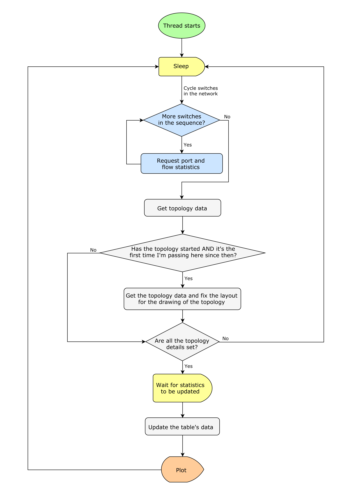

#### _monitor_threshold

~~~python
  def _monitor_threshold(self):
~~~

It's responsible for the load balancing in our system. This thread periodically checks whether one or more links in the network have exceeded the _LINK_THRESHOLD_ or not. In the case of a violation, a reallocation procedure is started (see [Reallocate](#reallocate )).

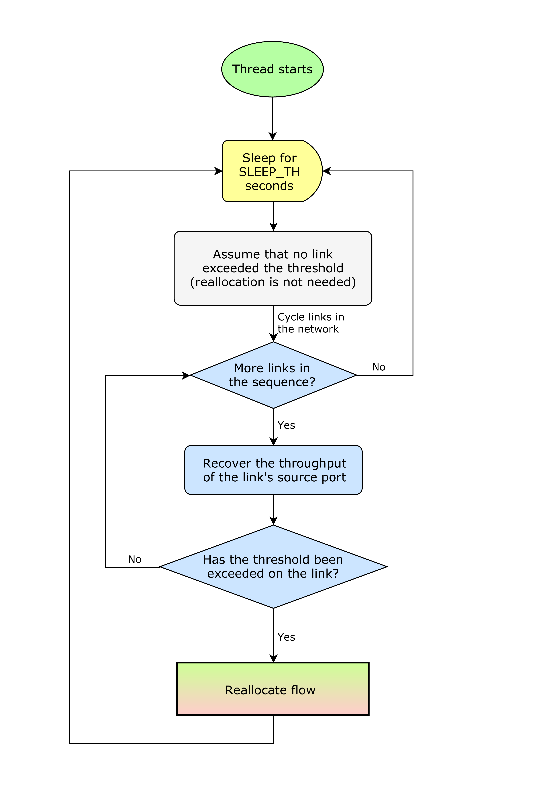

#### _request_flow_stats

~~~python
  def _request_flow_stats(self, datapath):
~~~

The controller uses this message to query information about flows statistics.

#### _request_port_stats

~~~python
  def _request_port_stats(self, datapath):
~~~

The controller uses this message to query information about port statistics.

#### reallocate_flow <a name="reallocate"></a>

~~~python
  def reallocate_flow(self, link_above_th):
~~~

Asynchronous function invoked by the thread __monitor_threshold_.

It is responsible for the reallocation of a flow in the case one or more links have an overall throughput greater than _LINK_THRESHOLD_.
There are two situations where, even if a violation has been detected, this function won't reallocate a flow:

- Multiple links have a throughput beyond the limit: only the first overloaded link found will undergo the reallocation process.
- Reallocation cannot be applied on the access network. Reallocation is possible only in the core network, where there are several paths available for each inlet-outlet pair. Instead, in the access network there is just one link, so even if it is overloaded, no reallocation is done to that link (otherwise the connection will be disrupted).

The new path is calculated as follows:

1) delete from the graph the link that has exceeded the threshold

2) delete the bandwidth used by that flow on all the links on its previous path

We also have to take care of the statistics we have saved for that link:

Example:

~~~python
    Previous path = [1, 2, 3, 4, 5, 6, 7]
    New path = [1, 2, 20, 21, 4, 23, 6, 7]
~~~

The function _remove_match_from_edge_, which deletes the matches that are not prensent in the switches' tables anymore, is called ONLY if the switch sends the _FlowRemoved_ notification to the controller.
If a switch is in common to both the previous and the new path, but its output port changes (so the next switch in the path is different), it won't send the elimination notification and the controller will never delete the flow's statistics on the link of the previous path.

##### PROBLEM

There will be an inactive link, because the switch changed port and the packets travel on a new link, but the statistics on the inactive link will be fixed to a value different from 0.

##### SOLUTION

If there are common switches with different ports, delete the statistics.

##### IMPLEMENTATION

Loop that checks if in the new path there are switches that are also present in the previous path.
By doing so, we also consider the **links** that are in common between the 2 paths (1-->2, 6-->7).

The rules will also be sent again to these switches, so timers and counters will be reset; this allows us to implement the above algorithm without problems arising.

Delete all the statistics from all the **switches** in common with the previous path (1-->2, 2-->3, 4-->5, 6-->7).

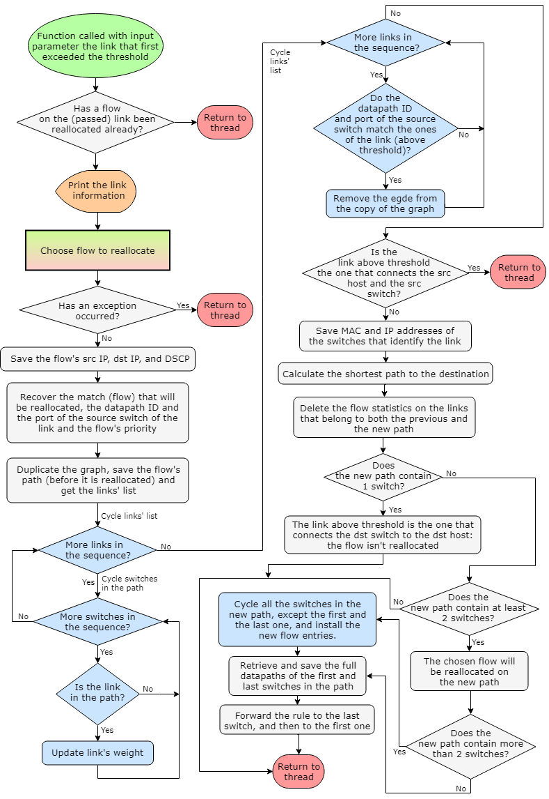

#### choose_match

~~~python
  def choose_match(self, link_above_th):
~~~

Asyncronous function invoked by *reallocate_flow*.

It takes as input the link with an overall throughput greater than **LINK_THRESHOLD** and returns the match that has to be reallocated.

The criteria by which a match is chosen are the following:

1. first look at the DSCP value in the ToS field
2. In case one or more matches have the same ToS the criteria will be to reallocate the flow that has the higher throughput.

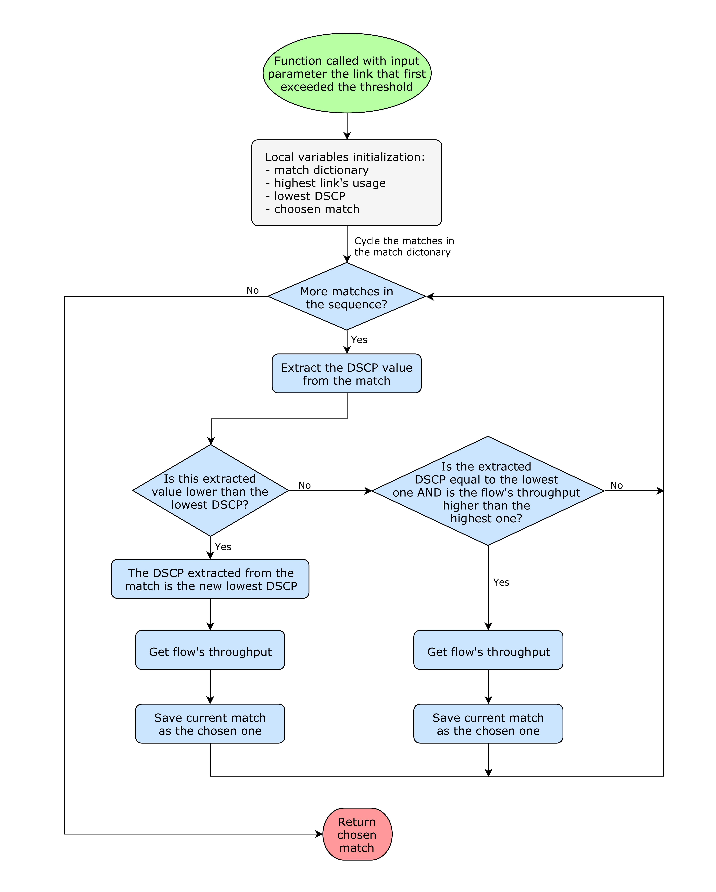

#### get_match_values

~~~python
  def get_match_values(self, match):
~~~

Function that takes as input a match and extracts some values from it. This values will be used to identify the flow in the plotted table.

Example of returned string:

~~~python
'10.0.0.1:6000 --> 10.0.0.2, ToS: 14'
~~~

#### update_table_data

~~~python
  def update_table_data(self):
~~~

Function invoked by the thread *_monitor*.

It resets and populates the plotted table according to the new statistics collected by the thread.

#### add_flow

~~~python
  def add_flow(self, datapath, priority, match, actions, idle_timeout, path, buffer_id=None):
~~~

If a flow is reallocated, we have to calculate a new path and install the new rules.
If a switch already has a rule with the same match, the rule is overwritten.

In the process of overwriting, we want counters and timers to be reset, in order not to have problems when we calculate the statistics.

To achive this, we reset the counters when we send the rule: we set the _OFPFF_RESET_COUNTS_ flag to 1 in the flags' bitmap.
The `OFPFlowMod` flags are:

- _OFPFF_SEND_FLOW_REM_ = 1<sub>dec</sub> = 1<sub>bin</sub> 
- _OFPFF_CHECK_OVERLAP_ = 2<sub>dec</sub>  = 10<sub>bin</sub> 
- _OFPFF_RESET_COUNTS_ = 4<sub>dec</sub>  = 100<sub>bin</sub> 
- _OFPFF_NO_PKT_COUNTS_ = 8<sub>dec</sub>  = 1000<sub>bin</sub> 
- _OFPFF_NO_BYT_COUNTS_ = 16<sub>dec</sub>  = 10000<sub>bin</sub> 

Bitmap between _OFPFF_SEND_FLOW_REM_ and _OFPFF_RESET_COUNTS_ (bitwise or):

~~~python
100 | 1 = 101
~~~

#### OFPMatch_to_tuple

~~~python
  def OFPMatch_to_tuple(self, match):
~~~

It's the same function as the _EdgeStats_ method [extract_fields](#extract_fields).It's necessary to duplicate this function, because only the EdgeStats object can access the _extract_fields_ method.

#### tuple_to_OFPMatch

~~~python
  def tuple_to_OFPMatch(self, parsed_match, dp):
~~~

In the class *EdgeStats* there is a method responsible for extracting the  fields that identify a flow as a tuple:

~~~python
    (eth_type, ipv4_src, ipv4_dst, ip_dscp, tcp_src, tcp_dst)
~~~

This tuple representation provides an easy and intuitive way to access the fields of a match, but on the other hand if that match has to be added in a flow table of a switch, it is necessary to reconvert it from a *tuple* to an object of the class `ryu.ofproto.ofproto_v1_3_parser.OFPMatch`.

That's exactly what this function does.

#### get_topology_data

```python
@set_ev_cls(event.EventSwitchEnter)
  def get_topology_data(self, ev):
```

This function is initially called when a new switch enters the network.
It is also called from:

- the __packet_in_handler_ (with ev = 1): it performs topology discovery, populates the _port_occupied_ dictionary, and returns the list of datapath IDs of the switches.
- the __monitor_ thread (with ev = 3): it gets the hosts information from the switches. 

Every time it's called, independently of the context, it updates the topology information.

#### _mac_learning

~~~python
  def _mac_learning(self, dpid_src, src, in_port):
~~~

Suppose we have the following topology:

>h1 <---> s1 <---> s2 <---> h2

When h2 opens a connection to h1, s2 send a _PacketIn_ message to the controller and, from this moment on, we know that h2 is directly connected to s2 via the _mac_to_dpid_ dictionary.

If, for some reason, s1 too sends a _PacketIn_ for the packet directed to h1, in the dictionary _mac_to_dpid_ we will have that h2 will be associated to both s1 and s2. This could happen if, for example, the controller installs the rule on s2 and, before it could install it on s1, a packet gets forwarded and causes a _PacketIn_ from s1. So there will be ambiguity and errors in the allocation of flows.

The problem has been partially solved by installing the rules on the switches following the path, but reversed, so opposite to the flow's propagation.
It could still arise if rules were to be deleted in the intermediate nodes (because of a timeout for example), and one of those intermediate nodes received a packet without having a rule installed.

We need to be careful that the _PacketIns_ corresponding to connections between hosts are made by the switches directly connected to the hosts, and not by the intermediate ones.

#### _handle_ipv4_packets

~~~python
  def _handle_ipv4_packets(self, pkt, ip4_pkt, ofproto, parser, datapath, dpid_src, src, dst):
~~~

It's invoked once the controller in the *_packet_in_handler* understands that the incoming packet is neither LLDP nor ARP, but it is IP.

Through this function, all the switches in the path from the source to the destination will be able to forward all the packets referring to that specific flow, without asking the controller.

The path is chosen looking for the shortest path.

The rule installation is done first in the intermediate nodes, then on the last and first node of the path. This is done because, if the controller installs the rule on the first switch in the path first, it could happen that packets get forwarded to the next switch before a rule is installed on it, causing PacketIns.
Changing the order in which the controller installs the rules prevents it: when the first switch starts to forward the packets, all the other switches will have rules to match that flow. Without reallocating, this problem is not present because TCP connections begin in slow start, so the source only sends one packets and waits for an acknoledgement. Instead, when the controller reallocates a flow, so it changes the rules while the flow is already set up, it happens that the switch connected to the source host starts forwarding packets to the second switch in the path, causing a massive amount of PacketIns and congestioning the controller. The same happens with UDP, even without reallocation, because it doesn't have the slow start algorithm.

Rules are installed on switches for both direction only if sender and receiver are connected to the same switch.

Rules can be of 3 types:

- _priority 3_: if the packet is TCP or UDP, the match will be the flow's identifying quintuple and its ToS;
- _priority 2_: for IP-forwarding;
- _priority 1_: if the packet is not TCP/UDP, install a rule so that if the switch will receive a TCP/UDP packet, it will send it to the controller.

Rule with priority 1 is installed simultaneously with rule of priority 2. Let's see why with this example:

>h1 sends a ping to h2: on the switches connecting h1 and h2 will be installed a rule with priority 2 for IP-forwarding and a rule with priority 1 for TCP/UDP packets.
>h1 starts a TCP connection with h2. Thanks to rule number 1, this flow will have a path different from the one of the packets of the ping.
>Moreover, having this rule allows the switch to dicriminate between IP-forwarding and TCP/UDP flows. Otherwise, with only the rule with priority 2, the switches will always match that rule (priority 2) both for TCP/UDP and IP packets, making the load balancing useless.

At the end a _PacketOut_ sends the packets back in the port's queue of the switch that sent the _PacketIn_.

For a simple example: [Use case](#ue1)

#### switch_features_handler

```python
@set_ev_cls(ofp_event.EventOFPSwitchFeatures, CONFIG_DISPATCHER)
  def switch_features_handler(self, ev):
```

Once the handshake between the switch and the controller is completed, the Table-Miss entry must be added in the flow table.

The table-miss flow entry:

- has priority 0
- matches all the incoming packets
- has as action to forward the packet to the controller

Thus, a packet matches it if and only if there is no other postive match in the flow table (the switch doesn't know how that packet should be handled).

#### _packet_in_handler

~~~python
  @set_ev_cls(ofp_event.EventOFPPacketIn, MAIN_DISPATCHER)
  def _packet_in_handler(self, ev):
~~~

Invoked whenever the controller receives an entire packet (or a fraction of it) from a switch.

This can occur, for example, in case of the table-miss: the switch doesn't know how to handle a packet and forwards it to the controller.

For a simple example: [Use case](#ue1)

#### flow_removed_handler

~~~python
  @set_ev_cls(ofp_event.EventOFPFlowRemoved, MAIN_DISPATCHER)
  def flow_removed_handler(self, ev):
~~~

When we install rules on the switches we set the flag _OFPFF_SEND_FLOW_REM_  to 1.
This way the controller is notified when a flow is removed from a switch due to the rule's idle timeout, or when a reallocation is performed.

The idle timeout occurs when a rule is not matched for a continuos time of _MAX_RTT_ADMITTED_ seconds, so it is automatically deleted by the switch.

#### port_stats_reply_handler

```python
@set_ev_cls(ofp_event.EventOFPPortStatsReply, MAIN_DISPATCHER)
  def port_stats_reply_handler(self, ev):
```

It handles the switches's port statistics requested by the thread __monitor_.
These statistics are saved in the correspondent link of the EdgeStats class.

### flow_stats_reply_handler

~~~python
  @set_ev_cls(ofp_event.EventOFPFlowStatsReply, MAIN_DISPATCHER)
  def flow_stats_reply_handler(self, ev):
~~~

It handles the switches's flow statistics requested by the thread __monitor_.
Thoese statistics are saved in the correspondent link of the EdgeStats class.

# Use Case <a name="ue1"></a>

### Hosts connected to the same switch

#### Topology

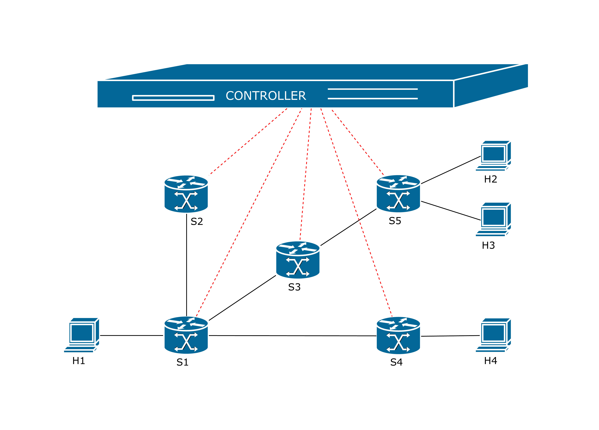


Once the topology is created, the switches will notify their presence to the controller (`EventOFPSwitchFeatures, CONFIG_DISPATCHER`). 

After this phase, each switch will have the table-miss flow entry in its flow table:

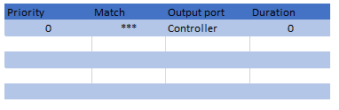

h2 is a server listening for TCP connections on port 4000.

h3 is a client that opens a TCP connection to h2 on port 4000.

Assuming that h2 has already performed the ARP request, the packet forwarded to the controller will be:


s5 starts a lookup process in his table to check whether it exists a flow entry that matches that flow. The only match is the **table-miss** , thus the packet is forwarded to the controller.

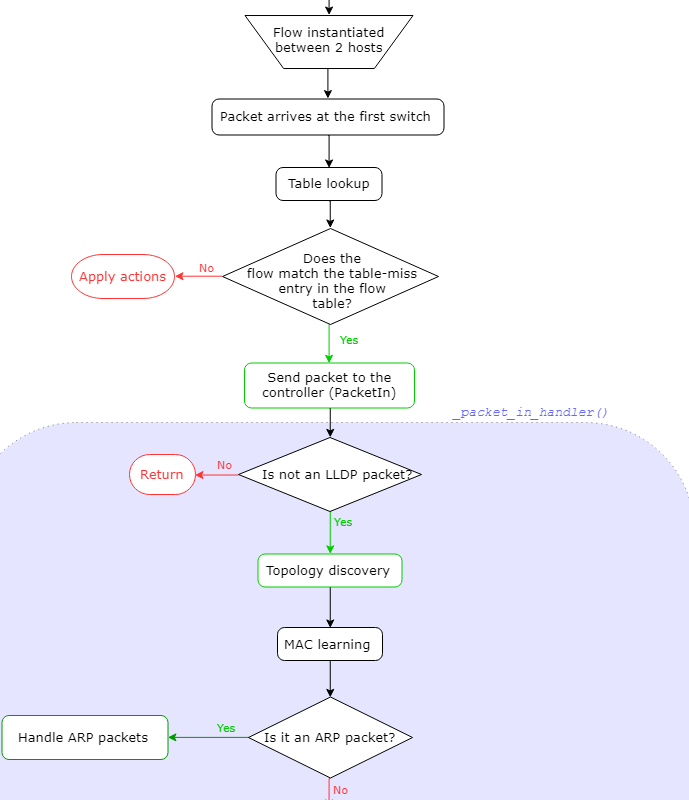

The controller receives the packet, and stores the MAC address of h2 in 3 dictionaries, with the corresponding switch port(blue cells are the keys and orange cells are the values):

 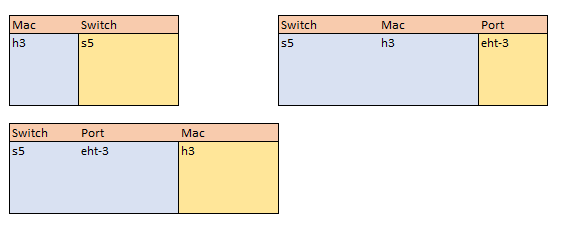

Then it performs topology discovery.

Looking at the ***eth_type field***, it understands that the received packet is IP. From the packet header, it extracts:

- src_MAC: MAC_H3
- dst_MAC: MAC_H2
- src_IP: IP_H3
- dst_IP: IP_H2
- IP_proto: IPv4
- src_port: 4050
- dst_port: 4000
- TOS field

Since this is the first packet for this flow, the function __handle_ipv4_packets_ will be entirely executed

The controller computes the shortest path based on the links' weights and discovers that h2 and h3 are connected to the same switch. It will add in s5 the rules for both directions: one for the flow from h3 to h2 and one for the flow from h2 to h3.

Finally, the controller forwards the packet back into to the interface of the switch.

The packet now matches a rule in the flow table, and is forwarded to h2.

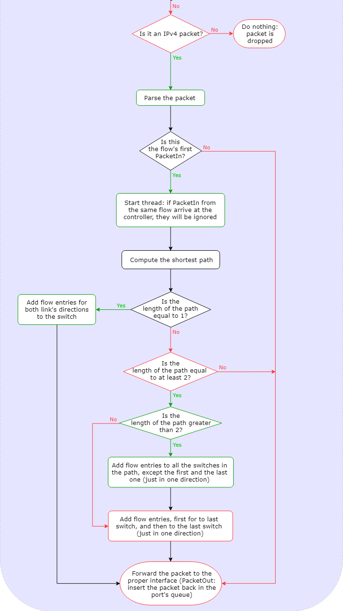

<!-- markdownlint-disable MD001 -->
<!-- markdownlint-disable MD041 -->

# realtimeplt <a name="plots"></a>

This module contains all the methods we use for plotting links' statistics and topology information.

### thr_table_and_bar_chart_plotter

Plots a table, and a bar chart graph stacked above it. The table has active flows as row labels, links as column labels, and each cell contains the flow's throughput on the link.

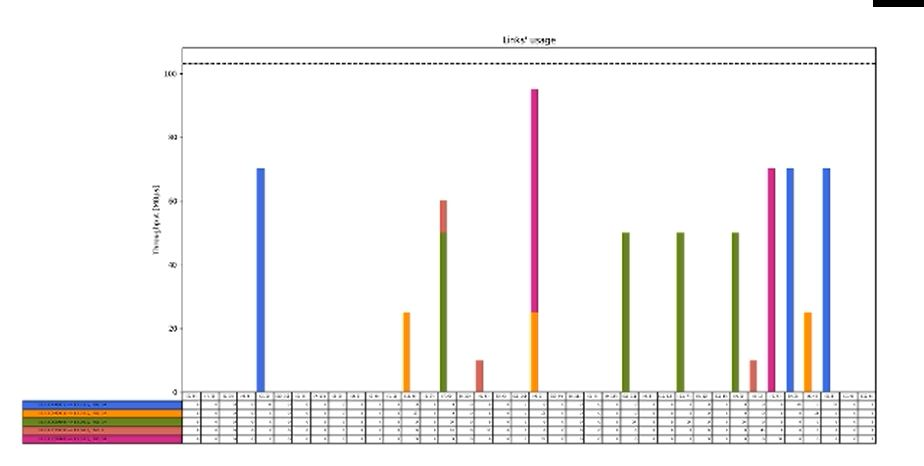

<div style="page-break-after: always;"></div>

### thr_plotter

 Plots each link's throughput real-time.

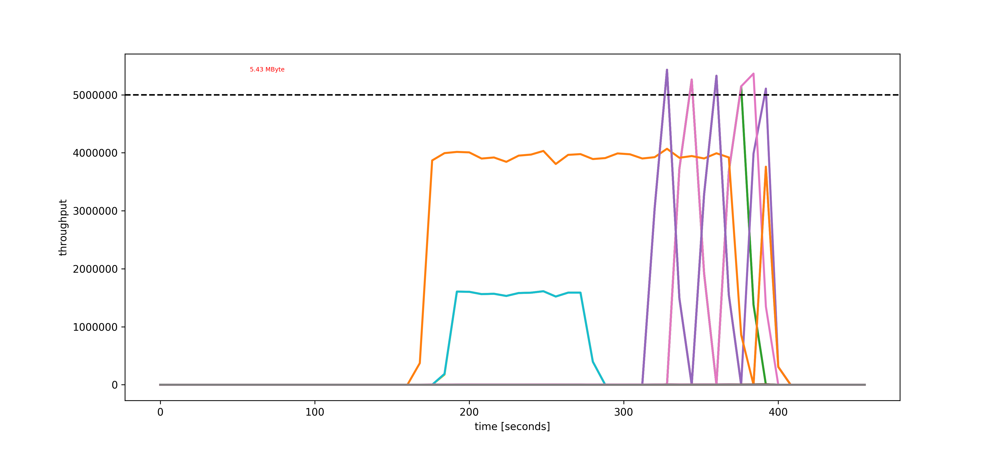

<div style="page-break-after: always;"></div>

### total_thr_pie_charts_plotter

Plots 2 pie charts, one for the average total throughput, and one for the instantaneous total throughput.

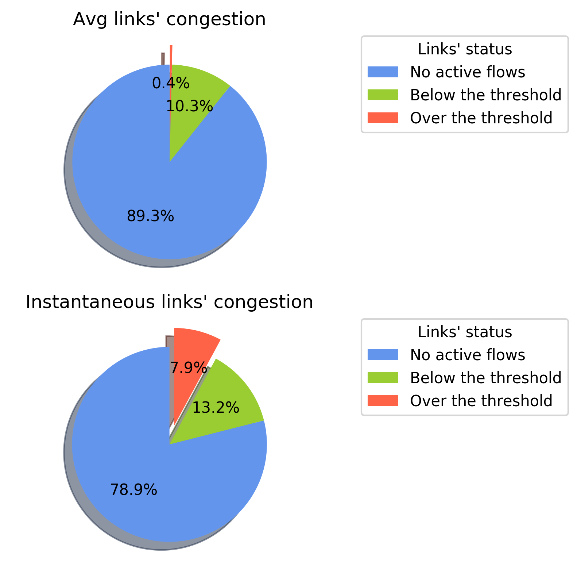

<div style="page-break-after: always;"></div>

### draw_topology

Draws the topology, with hosts and switches.

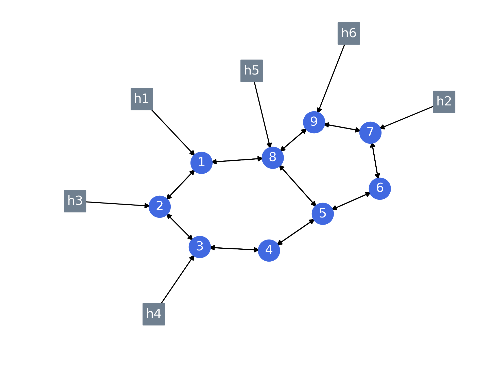

<div style="page-break-after: always;"></div>

<!-- markdownlint-disable MD007 -->
<!-- markdownlint-disable MD010 -->
<!-- markdownlint-disable MD041 -->
<!-- markdownlint-disable MD024 -->

# TestBed  <a name="testbed"></a>

The switches working on the testbed use a custom version of `OpenFlow`. As a consequence, we have encountered errors during our testing and we had to do modifications to the original code, in order to make it work on them.

## PROBLEM 1 <a name="p1"></a>

If a host wants to send a packet to an IP address, but it doesn't know the corresponding MAC address, it sends an ARP packet. At the end of this procedure, the controller, which has managed all the packets during the ARP discovery and reply, saves in the dictionary _mac_to_dpid_ the MAC addresses of the source and destination (using the __mac_learning_ function).

When we work with `mininet`, we first start the controller, and then the topology. So every time the controller is shut down, the topology is also shut down.

Working in the bonsai lab we have an always-on network. So, if we start a connection for the first time from _h1_ to _h2_, _h1_ sends an ARP packet. If we shut down and restart the controller, and re-do the same connection, _h1_ does not send an ARP packet anymore: this is because _h1_ already knows the MAC address of _h2_. Thus, when the controller tries to look into the dictionary __mac_to_dpid_ for the destination's datapath, a _KeyError_ is raised.

### SOLUTION <a name="s1"></a>

Clean the ARP tables on the hosts before starting the controller. For example:

~~~bash
    sudo arp -d 10.10.5.103
~~~

This command will delete the ARP table entry corresponding to the host identified by the IP address specified.

## PROBLEM 2 <a name="p2"></a>

When the controller reallocates a flow, it modifies the output port on some switches.
When a rule's _action_ is modified, the switches of the testbed reset the timers, but not the counters.

Let's look at an example, where:

~~~python
    prev_path = [1,2,3,4,5,6,7]
    path = [1,2,20,21,4,23,6,7]
~~~

### SOLUTION <a name="s2"></a>

If in the previous path we had the link 2-->3, and in the new one 2-->20, we take the value of the _prev_tx_bytes_ of 2-->3 and save it as _offset_ value in 2-->20. When we receive the 2-->20 link's statistics for the first time, we subtract the offset from the _byte_count_ that was returned, in order to have the actual number of transmitted bytes since the rule was installed. The offset has to be used just once, because the throughput is calculated as the difference between current and previous transmitted bytes: at the next statistics update, the offset will be already included in the previously transmitted bytes.

#### PROBLEM 2.1 <a name="p2.1"></a>

The byte count value of the 2-->3 link that we used as offset is the last value recorded since we requested the statistics: its value is smaller with respect to the one the rule had right before it was updated. We have a lack of bytes from the last statistics update to the time the rule is updated. As a result, the link has a higher throughput than the real one. This happens just the first time the link's statistics are updated, so from the second update on the value will be correct.

Since the bandwidth results are higher than the real ones, the link might be seen as over the threshold from the reallocation function.

##### SOLUTION A <a name="sA"></a>

Postpone the check for the reallocation, in order to wait for the second statistics update

##### SOLUTION B <a name="sB"></a>

We could assign to the link 2-->20 the throughput that the link 2-->3 had. This is done just the first time that the function that updates the statistics is called. From the second call:

- all the information related to the previous statistics are present
    - the offset due to the byte count pertinent to the previous link is considered in the prev_tx_bytes variable
- to calculate the throughput we look at the difference between the current and the previously transmitted bytes
Then we can proceed as always.

To implement this solution, we use the _switches_in_common_ list and the _prev_throughput_ dictionary.

##### TO VERIFY <a name="ver"></a>

Since both solutions are also applied to the LINKS in common between the two paths, it has to be verified that those links will behave like the rest, and so that the timers will be reset, but the counters won't. This verification could be done using a topology similar to the one we use in the second tutorial, but we were not able to perform it because we couldn't implement such topology with the available switches.
The verification could be done commenting the function the eliminates the congestioned link, in order to have a reallocation of the flow like before.
If on those links the byte_count value were to be reset, it could be possible to treat them in the same way they are treated in the `mininet` implementation.

We have implemented the version **A** by postponing the check for the reallocation.
[//]:# "spiegare meglio"

## PROBLEM 3 <a name="p3"></a>

Statistics about ports are not supported by switches.

### SOLUTION <a name="s3"></a>

Sum all the bandwidths of each active flow on that link to calculate the link's throughput.

## PROBLEM 4 <a name="p4"></a>

Switches, when replying to the __request_flow_stats_, put in the message a flow with an empty _action_ field.

In the function _flow_stats_reply_handler_ an error occurs when it tries to access that field.

### SOLUTION <a name="s4"></a>

If

~~~python
 stat.instructions[0].actions == []
~~~

skip it and go on with the next match in the list.

## PROBLEM 5 <a name="p5"></a>

In `mininet`, the MAC addresses of the hosts and the datapath IDs of the switches are incremental.

Example:

~~~python
    addHost('h1', mac="00:00:00:00:00:01")
    addHost('h2', mac="00:00:00:00:00:02")
    addSwitch('s1') ---> datapath.id = 1
    addSwitch('s2') ---> datapath.id = 2
~~~

When we plot the topology, we define the host's name as _h_ + the last two digits of the MAC address, and for switches we use the datapath ID.

In the switches of the testbed, datapath IDs are too long and hosts have no "incremental" MAC address.

### SOLUTION <a name="s5"></a>

Define two dictionaries, one for the hosts and one for the switches, to translate the real datapaths/MAC addresses to more user-frieldy numbers.

Example:

~~~python
		self.datapathid_to_name = {
									123917682136897: '1',
									123917682136938: '2',
									123917682136941: '3',
									123917682136957: '4',
									123917682136955: '5',
									123917682136935: '6'
							}

		self.host_to_mac = {
							'b8:27:eb:c2:10:5d': 'h2',
							'b8:27:eb:83:1b:e2': 'h3'
							}
~~~

<div style="page-break-after: always;"></div>

# Tutorial <a name="tutorial"></a>

## Tutorial 0 <a name="tutorial0"></a>

This tutorial describes how to setup the environment in which this project is defined.

### Mininet

**Mininet** is a *network emulator* which creates a realistic virtual network with virtual hosts, switches, controllers, and links (on a single machine (VM, cloud or native). Mininet hosts run standard Linux network software, and its switches support OpenFlow for highly flexible custom routing and Software-Defined Networking.

In order to download and install *Mininet* the following steps must be performed:

1. Download the [Mininet VM image](https://github.com/mininet/mininet/wiki/Mininet-VM-Images).
2. Download and install a virtualization system: [VirtualBox](https://www.virtualbox.org/wiki/Downloads) (free, GPL) it is free and works on OS X, Windows, and Linux.
3. Run through the [VM Setup Notes](http://mininet.org/vm-setup-notes/)  to log in to the VM and customize it as desired.
4. Follow the [Walkthrough](http://mininet.org/walkthrough) to get familiar with Mininet commands and typical usage.

### Ryu

**Ryu** is a component-based software defined networking framework. Ryu provides software components with well defined API that make it easy for developers to create new network management and control applications. Ryu supports various southbound protocols for managing network devices, such as [OpenFlow](https://www.opennetworking.org/), Netconf, OF-config, etc.

The easiest way to download and install *ryu* is to use the *pip* command

~~~bash
$ pip install ryu
~~~

Once the installation process is done a simple tutorial can be found [here](https://ryu.readthedocs.io/en/latest/getting_started.html)

<div style="page-break-after: always;"></div>

<!-- markdownlint-disable MD014 --->
<!-- markdownlint-disable MD007 --->
<!-- markdownlint-disable MD010 --->
<!-- markdownlint-disable MD001 --->

# Tutorial 1 <a name="tutorial1"></a>

This tutorial is aimed at showing that the controller:

- allocates flows based on the shortest path, avoiding overloaded links;
- if a link is above a certain threshold (_LINK_THRESHOLD_), scans the active flows in that link and reallocates the one with the lowest DSCP;
	- among flows with the same DSCP, it chooses the one with highest bandwidth.

## Controller settings

~~~python
DEFAULT_WEIGHT = 1
NUMBER_OF_SWITCH_PORTS = 6
SLEEP = 8
SLEEP_TH = SLEEP * 2
SLEEP_PLOT = SLEEP_TH * 2
MAGNITUDE_MEGA_BYTES = 10**6
LINK_THRESHOLD = 103 * MAGNITUDE_MEGA_BYTES
MAG_STR = "MByte"
MAX_RTT_ADMITTED = 2
PKT_IN_STOP_TIMER = 20
MIN_FLOW_BW = 0.3
~~~

## Commands for `ryu` and `mininet`

Open 2 terminal windows.

### Controller

To start the controller, from one of the terminals, run:

~~~bash
PHYTHONPATH=. /home/ryu/ryu/bin/ryu-manager --observe-links /path/to/the/controllers/file/load_balancer.py
~~~

### Topology

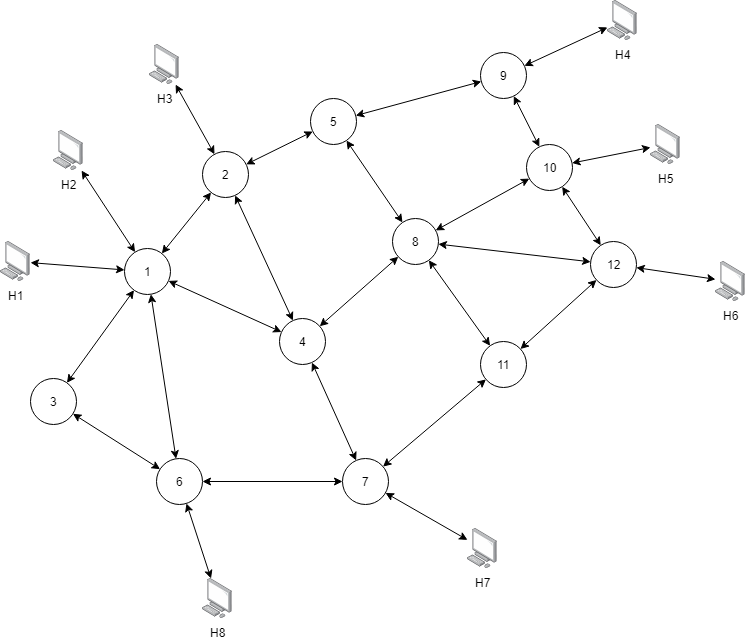

AFTER the controller has started, from the other terminal, run:

~~~bash
$ cd /path/to/the/file/of/the/topology
$ sudo mn --custom tutorial1_topo.py --topo mytopo --controller=remote
~~~

When the topology has been created, from the **mininet CLI**:

~~~bash
mininet> xterm h1 h1 h1 h1 h1
mininet> xterm h4 h5 h6 h7 h7
~~~

### Commands for `XTerm`

###### Constraints

The following constraints apply:

- Connections MUST start:
	- In the given order
	- Immediately after the statistics' update (so after the "-"*60 print)
		- This has to be done because, for each connection, `iPerf3` starts 3 connections (with different TCP ports and ToS 0) before starting the definitive one with the correct ToS: that requires some time
		- If a connection starts and, in the meantime, statistics' update, the definitive flow won't follow the predicted path: it sees that the first path was used (by those 3 starting connections) and so it searches for a better one
- After the first connection has been set up, before starting another connection, wait AT LEAST 2 statistics' updates
	- In order to let the previously installed connection stabilize at the rate specified in the `iPerf3` command (TCP slowstart mechanism)
- The bandwidth must be specified in bit/s and not in Byte/s

*To paste commands in the XTerm windows, use "middle click" or "shift-insert".*

#### Servers (h1)

In each _h1_ XTerm window, using `iPerf3`, start a server (_-s_). Each server is listening for TCP connections on the port specified by the flag _-p_ and will print the transmitted bytes and the bandwidth every second (flag _-i_).

N.B. The port numbers can be changed, but each server must have its own unique number of port. The time interval specified with the flag _-i_ can be changed, or omitted.

~~~bash
iperf3 -s -p 4000 -i 1
~~~

~~~bash
iperf3 -s -p 5000 -i 1
~~~

~~~bash
iperf3 -s -p 6000 -i 1
~~~

~~~bash
iperf3 -s -p 7000 -i 1
~~~

~~~bash
iperf3 -s -p 7500 -i 1
~~~

#### Hosts (h4, h5, h6, h7 h7)

Respecting the [constraints](#Constraints), start the TCP connections.
The flags are:

- _-c_ : tells the client to connect to an `iPerf3` server running on a specified host, in our example it's always _h1_ (IP address 10.0.0.1)
- _-p_ : specifies the port the server is listening on, and to which the client connects to
- _-t_ : how long the connection lasts, in seconds
- _-i_ : the time interval in seconds between periodic bandwidth, jitter, and loss reports
	- can be omitted
- _-b_ : target bandwidth of _N_ bits/sec
- _-S_ : type-of-service for outgoing packets
	- if omitted, it defaults to zero
	- ToS = 0x38<sub>hex</sub> = 56<sub>dec</sub> ==> DSCP = 14<sub>dec</sub>

~~~bash
iperf3 -c 10.0.0.1 -p 4000 -t 500 -i 1 -b 560M -S 0x38
~~~

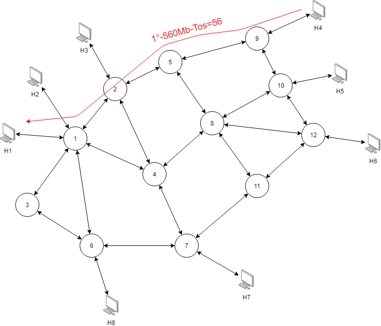

~~~bash
iperf3 -c 10.0.0.1 -p 5000 -t 500 -i 1 -b 200M -S 0x38
~~~

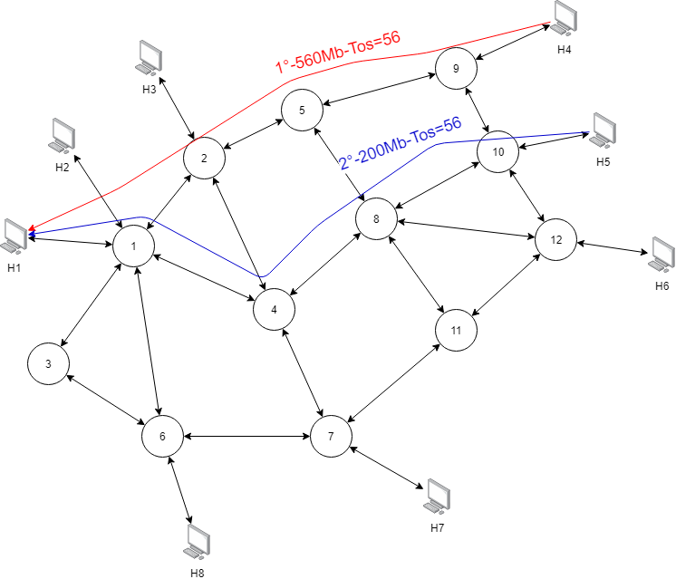

~~~bash
iperf3 -c 10.0.0.1 -p 6000 -t 500 -i 1 -b 400M -S 0x38
~~~

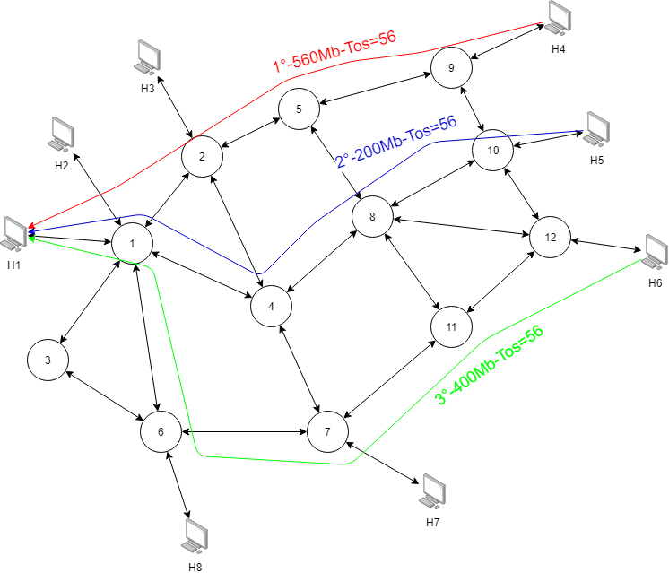

~~~bash
iperf3 -c 10.0.0.1 -p 7000 -t 500 -i 1 -b 80M
~~~

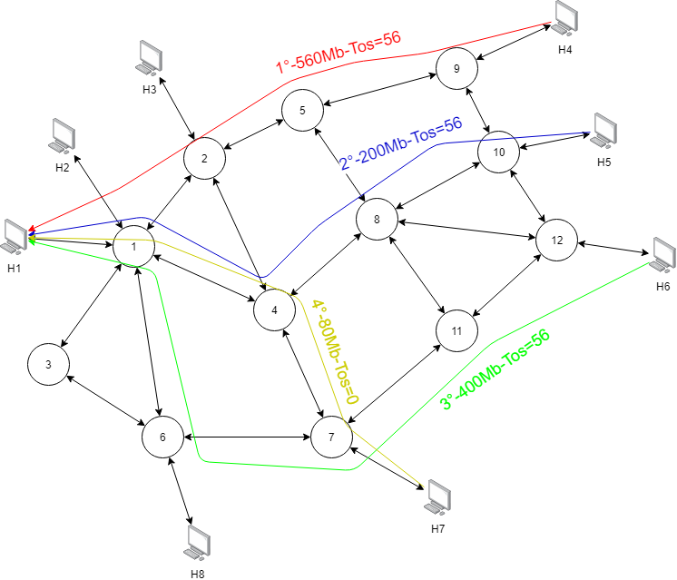

~~~bash
iperf3 -c 10.0.0.1 -p 7500 -t 500 -i 1 -b 560M -S 0x38
~~~

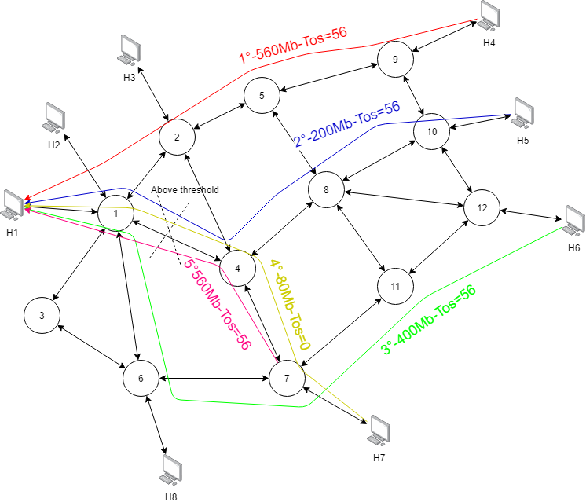

The flow with the lowest ToS (the 4th one, between h1 and h7) is reallocated.

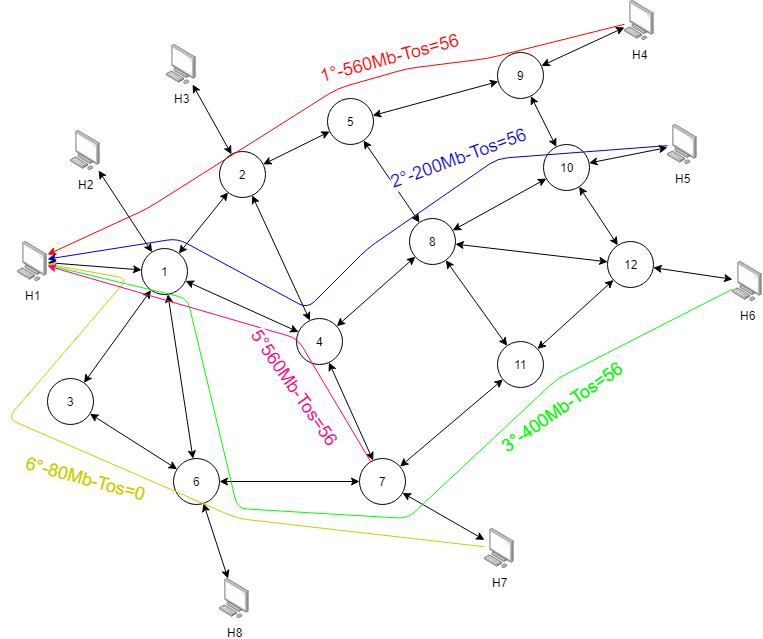

## Results

[Link to Youtube video](https://youtu.be/1yEEJhPy4O8)

<!-- markdownlint-disable MD014 --->
<!-- markdownlint-disable MD007 --->
<!-- markdownlint-disable MD010 --->
<!-- markdownlint-disable MD001 --->

<div style="page-break-after: always;"></div>

# Tutorial 2 <a name="tutorial2"></a>

This tutorial aims at showing that, when a flow reallocation occurs, the controller does not consider the weight of the flow that is going to be reallocated (on the links of the path where this flow is, just before the reallocation) when looking for a new path.

## Controller settings

~~~python
DEFAULT_WEIGHT = 1
NUMBER_OF_SWITCH_PORTS = 4
SLEEP = 8
SLEEP_TH = SLEEP * 2
SLEEP_PLOT = SLEEP_TH * 2
MAGNITUDE_MEGA_BYTES = 10**6
LINK_THRESHOLD = 103 * MAGNITUDE_MEGA_BYTES
MAG_STR = "MByte"
MAX_RTT_ADMITTED = 2
PKT_IN_STOP_TIMER = 20
MIN_FLOW_BW = 0.3
~~~

## Commands for `ryu` and `mininet`

Open 2 terminal windows.

### Controller

To start the controller, from one of the terminals, run:

~~~bash
PHYTHONPATH=. /home/ryu/ryu/bin/ryu-manager --observe-links /path/to/the/controllers/file/load_balancer.py
~~~

### Topology

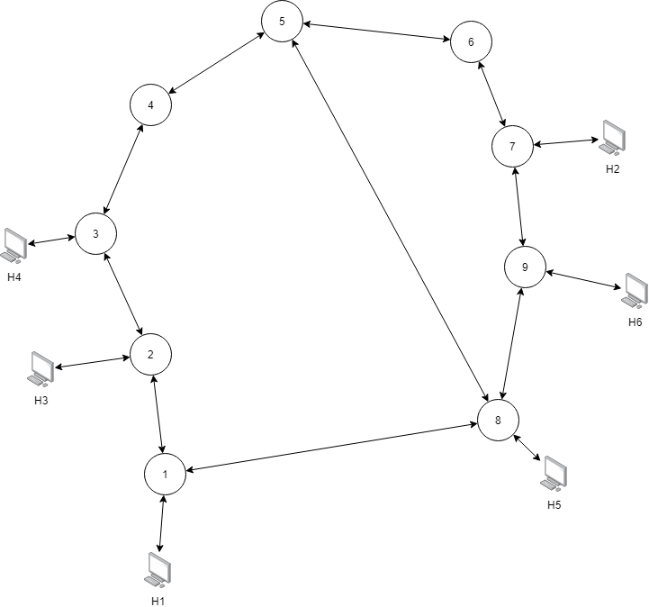

AFTER the controller has started, from the other terminal, run:

~~~bash
$ cd /path/to/the/file/of/the/topology
$ sudo mn --custom tutorial2_topo.py --topo mytopo --controller=remote
~~~

When the topology has been created, from the **mininet CLI**:

~~~bash
mininet> xterm h1 h4 h6
mininet> xterm h1 h3 h5
~~~

### Commands for `XTerm`

###### Constraints

All 3 connections must start

- simultaneously (one after the other, without waiting), this way the shortest path algorithm will allocate them relying on the same statistics (so h1-->h2 will not be affected by the flow on h5-->h6)
- immediately after the statistics' update (so after the "-"*60 print)
	- this has to be done because, for each connection, `iPerf3` starts 3 connections (with different TCP ports and ToS 0) before starting the definitive one with the correct ToS, and that requires some time
	- if a connection starts and, in the meantime, statistics' update, the definitive flow won't follow the predicted path: it sees that the first path was used (by those 3 starting connections) and so it searches for a better one

This way, the shortest path will not be different from the predicted one, because the controller will base its calculations on the same links' weights for all 3 connections.

It can happen that the weight of a link without the value of the flow being reallocated is different from 0, even if there is just 1 flow.
This occurs because we assign weights to arcs looking at the throughput of the source port of the link, and this value is usually different from the sum of all the flows' thoughputs on that link (because the requested flows' and ports' statistics do not arrive simultaneously to the controller).

*To paste commands in the xterm windows, use "middle click" or "shift-insert".*

##### `iPerf3` flags

- _-c_ : tells the client to connect to an `iPerf3` server running on a host, identified by its IP address
- _-p_ : specifies the port the server is listening on, and to which the client connects to
- _-t_ : how long the connection lasts, in seconds
- _-i_ : the time interval in seconds between periodic bandwidth, jitter, and loss reports
	- can be omitted
- _-b_ : target bandwidth of _N_ bits/sec
- _-S_ : type-of-service for outgoing packets
	- if omitted, it defaults to zero
	- ToS = 0x24<sub>hex</sub> = 36<sub>dec</sub> ==> DSCP = 9<sub>dec</sub>

#### First connection

##### Server (h2)

~~~<a name="tutorial2"></a>
ipe<a name="tutorial2"></a>
~~~<a name="tutorial2"></a>

##### Host (h1)

~~~bash
iperf3 -c 10.0.0.2 -p 5000 -t 500 -i 1 -b 400M
~~~

#### Second connection

##### Server (h4)

~~~bash
iperf3 -s -p 4000 -i 1
~~~

##### Host (h3)

~~~bash
iperf3 -c 10.0.0.4 -p 4000 -t 500 -i 1 -b 160M -S 0x24
~~~

#### Third connection

##### Server (h6)

~~~bash
iperf3 -s -p 6000 -i 1
~~~

##### Host (h5)

~~~bash
iperf3 -c 10.0.0.6 -p 6000 -t 500 -i 1 -b 640M -S 0x24
~~~

## Results

After the 3 connections are started, the situation of the network is the following:

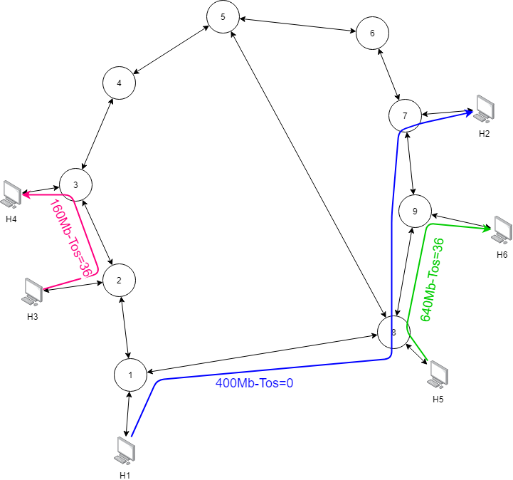

The link that connects s8 and s9 has exceeded the set threshold: one of the flows on that link will be reallocated.

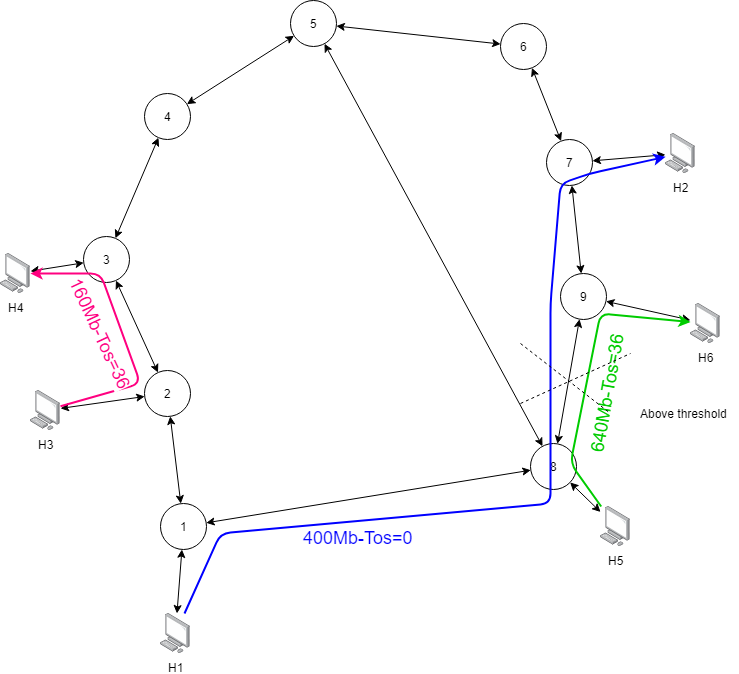

Since the blue connection has a ToS value which is lower than the one of the green connection, it is reallocated. The new path still contains the (1, 8) link, thus the shortest path is computed without considering the throughput of the reallocated flow.

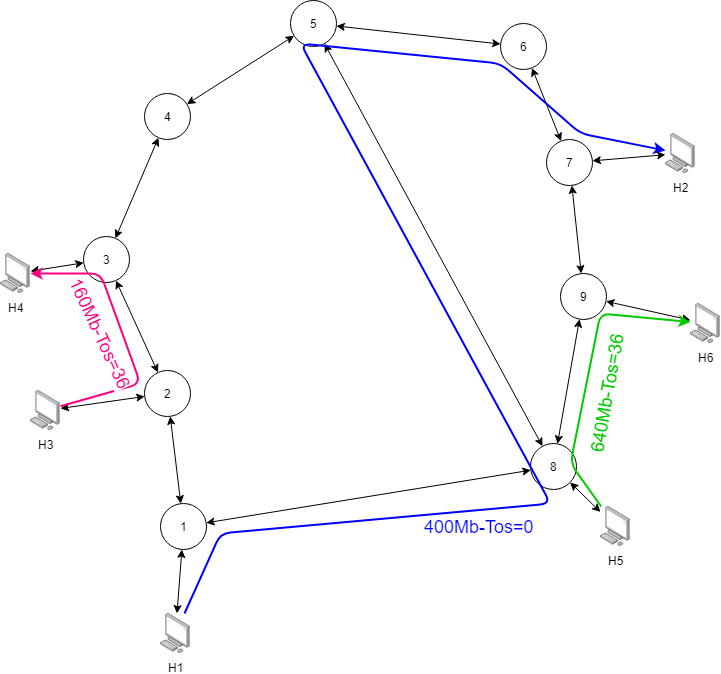

---

[Link to Youtube video](https://youtu.be/W95KeX04cLM)

<div style="page-break-after: always;"></div>

# References and Tools <a name="ref"></a>

​[1] Project assignment https://beep.metid.polimi.it

​[2] Project template ***sar_application_SDN.py***

​[3] OpenFlow protocol API documentation  https://ryu.readthedocs.io/en/latest/ofproto_v1_3_ref.html

​[4] RYU book https://osrg.github.io/ryu-book/en/Ryubook.pdf

​[5] RYU https://osrg.github.io/ryu/

​[6] Draw.io software tool to make diagrams

[7] Mininet  http://mininet.org/download/

​[6] Markdown Tutorial https://www.markdowntutorial.com

​[7] iPerf3 documentation https://iperf.fr/iperf-doc.php

​[8] Matplotlib documentation https://matplotlib.org

[9] NetworkX documentation https://networkx.github.io/documentation/stable/#

<div style="page-break-after: always;"></div>
